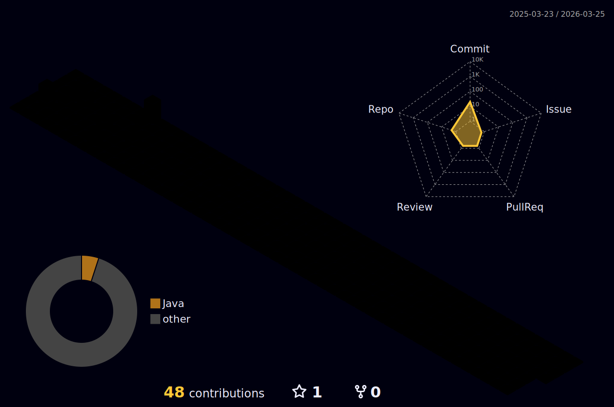

<!-- GitHub Profile README for Maria Fernandes -->

  <!-- Animated Banner with Gradient Background -->
  

  <!-- Typing Animation -->
  <h3>
    
  </h3>

  <!-- Profile Views Counter -->
  

<!-- About Me -->
<h2>About Me</h2>

  Passionate Data Analyst with over 8 years of experience in data analysis 💗, modeling, and engineering. Throughout my career, I've focused on transforming raw data into strategic, robust solutions that drive business success and empower decision-making.

  My journey in data has allowed me to master a wide range of programming languages and frameworks, including Python, SQL, R, and NoSQL databases. I take pride in writing clean, maintainable code and designing efficient algorithms to solve complex problems with clarity and impact.

  I'm deeply committed to continuous learning and staying ahead of industry trends. Whether I'm exploring data science, diving into machine learning applications, or refining data architecture, I'm always excited to expand my technical horizons and deliver excellence in everything I build.

  I believe data is the new oil — and refining it into meaningful insights requires skill, vision, and passion 💗✨ . That's what drives me every day.

  

<!-- Skills Section with Technologies Side by Side -->
<h2>Skills & Technologies</h2>

<h3>Programming Languages</h3>

  
  
  
  
  
  
  
  

<h3>Tools & Platforms</h3>

  <!-- Power BI (SVG from Wikimedia) -->
  
  <!-- Databricks (PNG fallback) -->
  <!--  -->
  <!-- Docker (devicon) -->
  
  <!-- Apache Spark (SVG from Wikimedia) -->
  
  <!-- Google Cloud -->
  
  <!-- Azure DevOps -->
  

<h3>Level</h3>
<ul>
  <li><b>Advanced:</b> Python, SQL, ETL, R</li>
  <li><b>Intermediate:</b> Spark, Docker, Java, JavaScript, C#</li>
  <li><b>Beginner:</b> Machine Learning, Looker, Julia, Matlab, Scilab</li>
</ul>

  

<!-- GitHub Stats -->
<!-- <h2>GitHub Stats</h2>

  

<!-- Language Distribution -->
<!-- <h2>Language Distribution</h2>

  

 --> -->

<!-- GitHub Achievements -->
<h2>GitHub Achievements</h2>

  

<!-- Contribution Activity -->
<h2>Contribution Activity</h2>

  

<!--Contribution Grid -->
<h2>Contribution Grid</h2>

  

<!-- Languages -->
<h2>Languages</h2>
<ul>
  <li> Portuguese – Native</li>
  <li> English – Advanced</li>
  <li> Spanish – Intermediate</li>
</ul>

<!-- Contact Information -->
<h2>Contact</h2>

  
  

<!-- Footer -->

  

