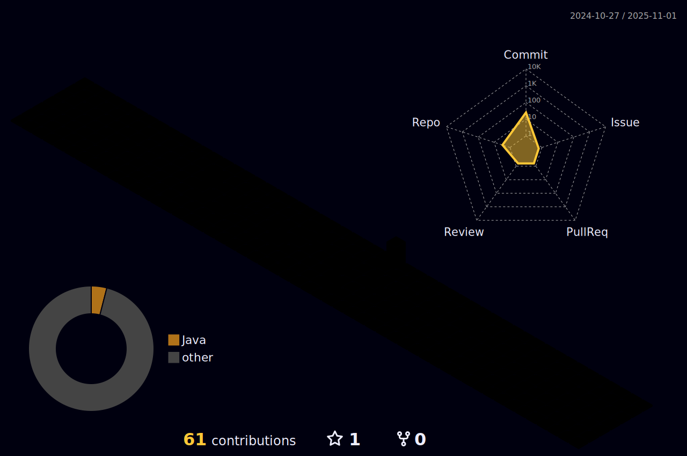

<!-- GitHub Profile README for Maria Fernandes -->

  <!-- Animated Banner with Gradient Background -->
  

  <!-- Typing Animation -->
  <h3>
    
  </h3>

  <!-- Profile Views Counter -->
  

<!-- Brief Bio -->
<h2>Sobre Mim</h2>

  Senior Data Analyst com mais de 8 anos de experiência em análise de dados, visualização e desenvolvimento de dashboards estratégicos. Sólida expertise em SQL, Python e R. Minha paixão está em transformar dados brutos em insights acionáveis que orientam decisões e geram valor de negócio. Experiência em automação de pipelines, criação de KPIs e metodologias ágeis (SCRUM).

  Atuação com automação de processos, modelagem de dados, desenvolvimento de dashboards e visualizações, além de consultoria em projetos de dados. Foco em entregar soluções que impactam o negócio e otimizam a tomada de decisão.

  

<!-- Skills Section with Technologies Side by Side -->
<h2>Skills & Technologies</h2>

<h3>Linguagens de Programação</h3>

  
  
  

  
  
  

<h3>Ferramentas e Plataformas</h3>

  
  
  
  
  
  

<h3>Nível</h3>
<ul>
  <li><b>Avançado:</b> Python, SQL, ETL, R</li>
  <li><b>Intermediário:</b> Spark, Docker</li>
  <li><b>Iniciante:</b> Machine Learning, Looker</li>
</ul>

  

<!-- GitHub Activity Stats Cards -->
<h2>GitHub Stats</h2>

  
  

<!-- GitHub Contribution Streak -->

  

<!-- GitHub Trophies -->
<h2>GitHub Achievements</h2>

  

<!-- 3D Contribution Grid (SVG element generated via GitHub Action) -->
<h2>3D Contribution Grid</h2>

  

<!-- Language Distribution (Animated Donut Chart - GitHub Actions) -->
<h2>Language Distribution</h2>

  

<!-- Featured Projects with Cards -->
<h2>Featured Projects</h2>

  
  

<!-- Activity Graph -->
<h2>Contribution Activity</h2>

  

<picture>
  <source media="(prefers-color-scheme: dark)" srcset="https://raw.githubusercontent.com/mafealvesf/mafealvesf/output/github-snake-dark.svg" />
  <source media="(prefers-color-scheme: light)" srcset="https://raw.githubusercontent.com/mafealvesf/mafealvesf/output/github-snake.svg" />
  
</picture>

<!-- Contact Information -->
<h2>Connect With Me</h2>

  
  

<!-- Footer -->

  

